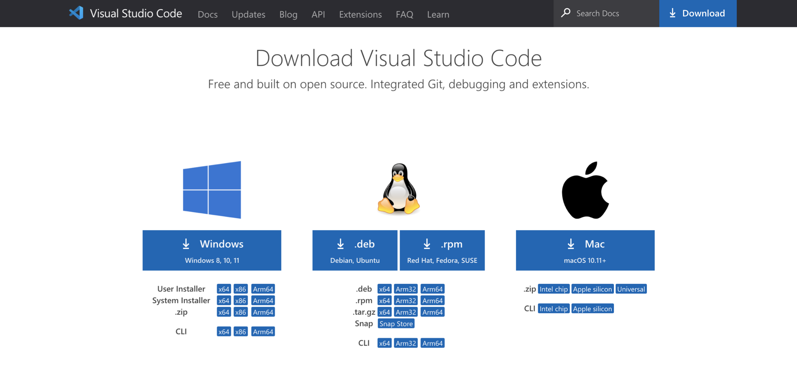
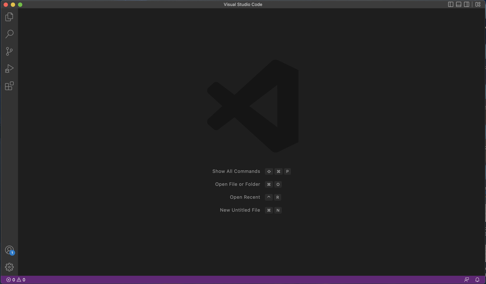
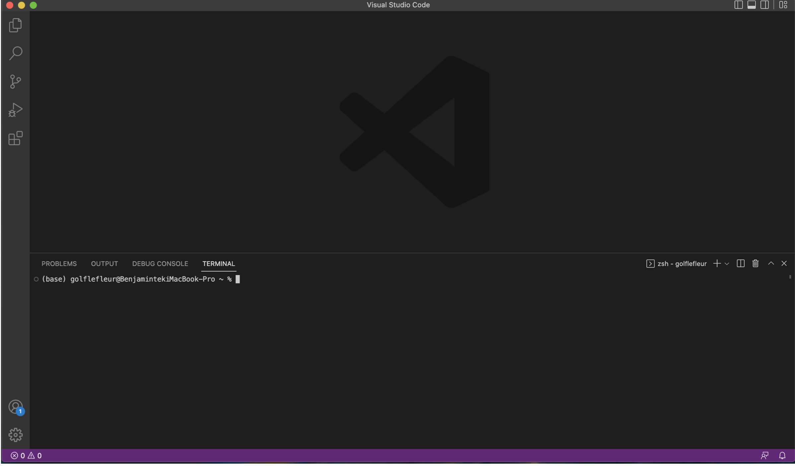
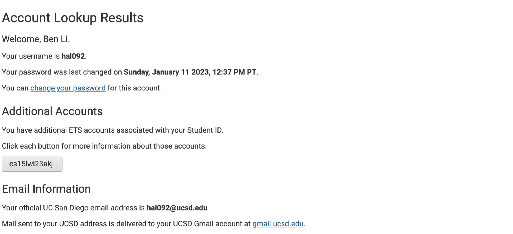
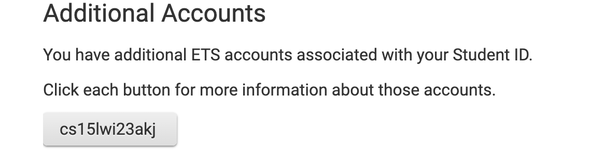

# A Quick Guide to Remote Acess for CSE 15L

   This quick guide that I've step up will hopefully teach you how to set up a remote access account into a course account on ieng6. The steps include: 
      
   1. Installing a Source Code Editor (preferably VS Code).
   2. Establishing a remote connection through your terminal
   3. Exploring the remote connection with some commands
        
        
      
   ## Step One: Installing VS Code
   
   - Click on this link [link](https://code.visualstudio.com/download) and it will take you to the VS Code download page:
   
   
   - Download the version according to your operating system and open up the newly downloaded VS Code. It should look something like this:
   
   
   - Now you can open up the terminal on your VS Code. (command J on mac and command or ctrl + on windows to open up a new terminal). 
   
   - Now that we have set up everything, your terminal should look like this:
   

   ## Step Two: Connect to the CSE 15L Remote Server
   
  Now that our VS Code is set up and running, we could use the terminal to set up a remote connection to a server. But first, we need to found our           CSE15L account in this link: 
  
  https://sdacs.ucsd.edu/~icc/index.php
  
  **Password Reset** : Follow this [tutorial](https://docs.google.com/document/d/1hs7CyQeh-MdUfM9uv99i8tqfneos6Y8bDU0uhn1wqho/edit) to reset your     password for remote connection.
  
  - Once you have looked up for accound information, you would arrive at a page like this: 
  
  
  
  - **You want to click on the box that starts with cs15l under Additional Accounts:**
  
  
  - You will arrive at a new page that states your *username*. This username is a important information for you to connect to the remote server.

  - If you are using a windows system, then you will need to install git: 

   [Git for Windows](https://gitforwindows.org/)

  After installation, follow these [steps](https://stackoverflow.com/questions/42606837/how-do-i-use-bash-on-windows-from-the-visual-studio-code-integrated-terminal/50527994#50527994) to step up git bash in your windows VS Code terminal. 
  
  
  
 

      
   
