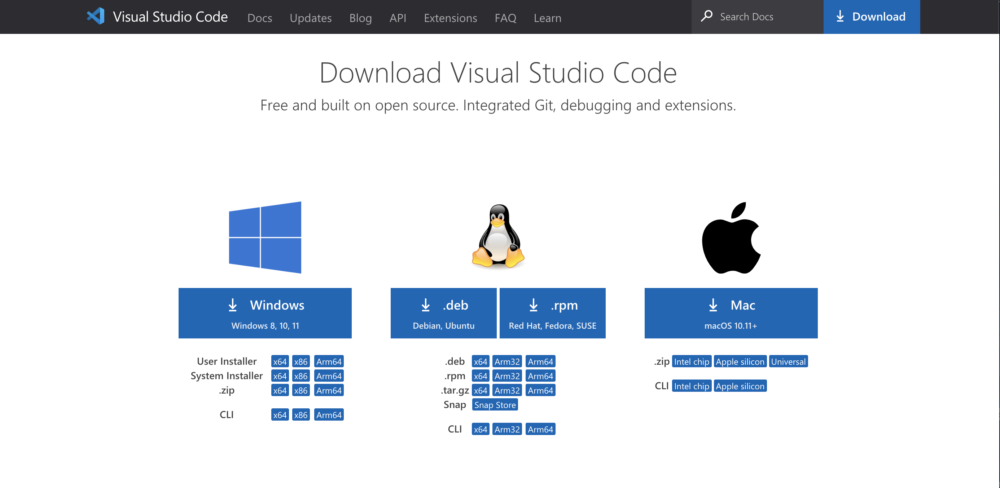

# A Quick Guide to Remote Acess for CSE 15L

      This quick guide that I've step up will hopefully teach you how to set up a remote access account into a course account on ieng6. The steps include: 
      
        1. Installing a Source Code Editor (preferably VS Code).
        2. Establishing a remote connection through your terminal
        3. Exploring the remote connection with some commands
        
        
      
   ## Step One: Installing VS Code
   
   - Click on this link [link](https://code.visualstudio.com/download) and it will take you to the VS Code download page:
   
