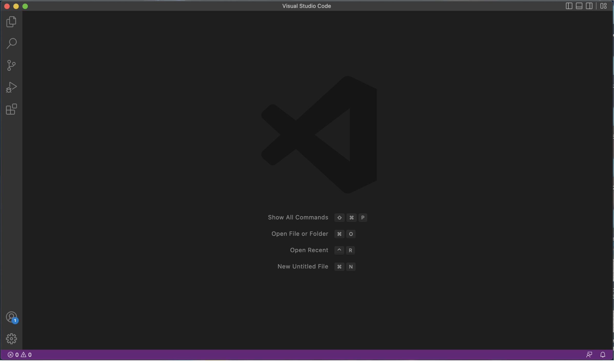
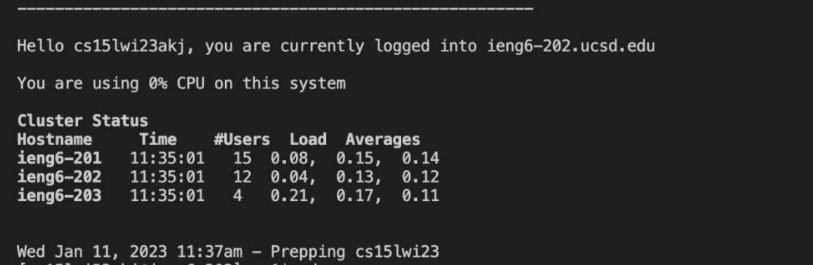
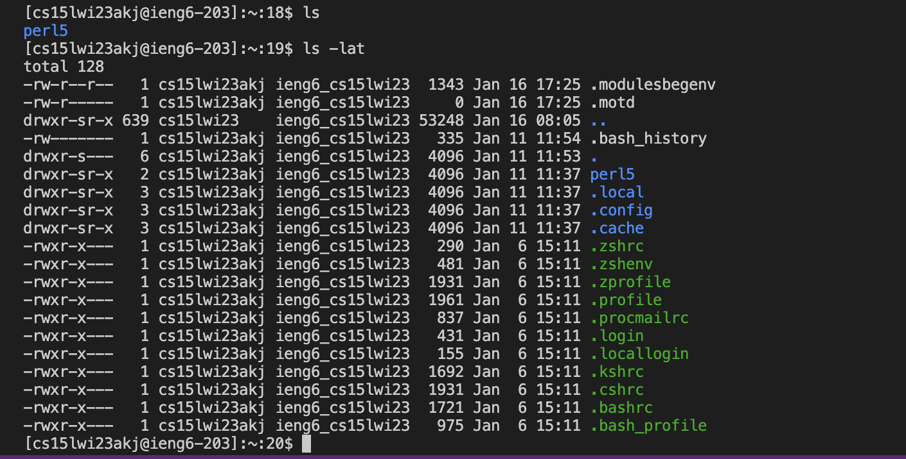
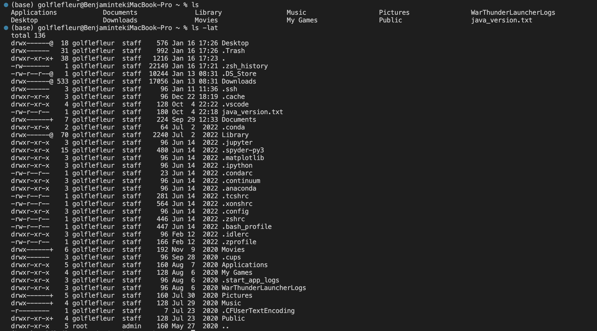
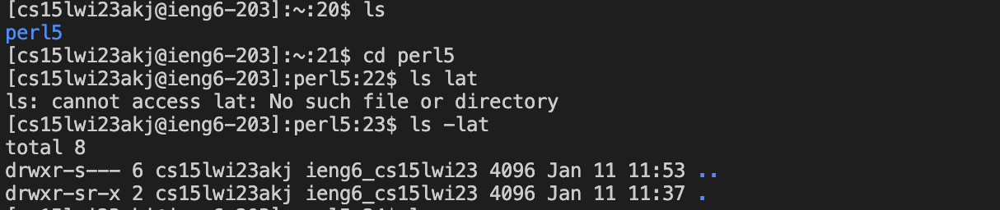
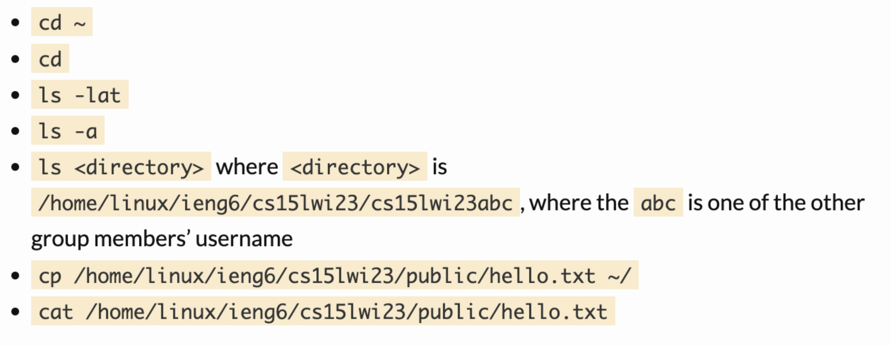

# A Quick Guide to Remote Acess for CSE 15L

   This quick guide that I've step up will hopefully teach you how to set up a remote access account into a course account on ieng6. The steps include: 
      
   1. Installing a Source Code Editor (preferably VS Code).
   2. Establishing a remote connection through your terminal
   3. Exploring the remote connection with some commands
        
        
      
   ## Step One: Installing VS Code
   
   - Click on this link [link](https://code.visualstudio.com/download) and it will take you to the VS Code download page:
   
   
   - Download the version according to your operating system and open up the newly downloaded VS Code. It should look something like this:
   
   
   - Now you can open up the terminal on your VS Code. (command J on mac and command or ctrl + on windows to open up a new terminal). 
   
   - Now that we have set up everything, your terminal should look like this:
   

   ## Step Two: Connect to the CSE 15L Remote Server
   
  Now that our VS Code is set up and running, we could use the terminal to set up a remote connection to a server. But first, we need to found our           CSE15L account in this link: 
  
  https://sdacs.ucsd.edu/~icc/index.php
  
  **Password Reset** : Follow this [tutorial](https://docs.google.com/document/d/1hs7CyQeh-MdUfM9uv99i8tqfneos6Y8bDU0uhn1wqho/edit) to reset your     password for remote connection.
  
  - Once you have looked up for accound information, you would arrive at a page like this: 
  
  
  
  - **You want to click on the box that starts with cs15l under Additional Accounts:**
  
  
  - You will arrive at a new page that states your *username*. This username is a important information for you to connect to the remote server.

  - If you are using a windows system, then you will need to install git: 

   [Git for Windows](https://gitforwindows.org/)

  After installation, follow these [steps](https://stackoverflow.com/questions/42606837/how-do-i-use-bash-on-windows-from-the-visual-studio-code-integrated-terminal/50527994#50527994) to step up git bash in your windows VS Code terminal. 
  
  Now, we have to use ssh to open up the connection to the server:
               
                ssh cs15lwi23**@ieng6.ucsd.edu
                
  - Replace ** with the letters in your own course specific account
  
  - Since this is your first time logging in, the terminal will display a message that says:
  
               ⤇ ssh cs15lwi23zz@ieng6.ucsd.edu
               The authenticity of host 'ieng6.ucsd.edu (128.54.70.227)' can't be established.
               RSA key fingerprint is SHA256:ksruYwhnYH+sySHnHAtLUHngrPEyZTDl/1x99wUQcec.
               Are you sure you want to continue connecting (yes/no/[fingerprint])? 

  - Type in yes and the terminal will prompt you to enter your password, and now you are connected! The page on the terminal should display this:

   
  
  **Now your terminal is connected to the servers in the CSE Basement! We can move on to the final step where I will show you some basic commands that you could try on remote connection.**

  
  ## Step Three: Exploring some commands
  
  - Now as we are connected to the remote server, we can try some commands such as ls and ls -lat, it will print the following message on the remote server:

 - Now if we exit the connection by pressing control D and use the same commands on our local terminal, it will print something similar to this:

**We can resonably assume that the ls commands display some form of directory files in both the remote server and local computer**

- Now lets try chaining some cd commands after finding our directory files. 
- As you can see from the ls command, it displays a file called perl5, so we can change our current directory to perl5 using cd and list the files in that directory:

There are other commands listed here that you can explore with: 

*This screenshot was presented to us during the first lad we had. Hope this will help you out!*

- After you are done, press control d to exit the terminal

  
 

      
   
