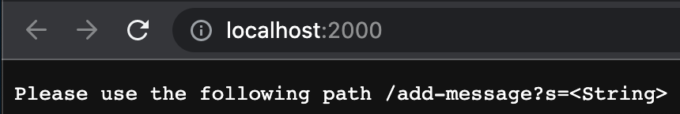
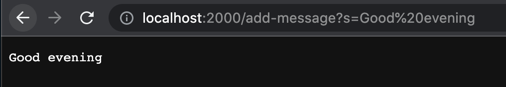
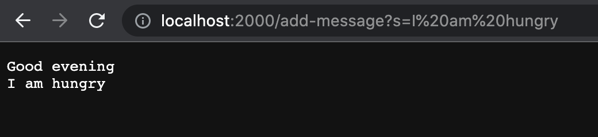
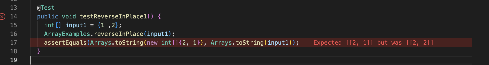

# Lab Report 2 - Servers and Bugs


## Part 1: StringServer web server

In this part I have written a simple server that allows the website to take in specific string inputs and return those values onto the website. Here is my code for StringServer
   
```
import java.io.IOException;
import java.net.URI;

class Handler implements URLHandler {

    String result = "";
    public String handleRequest(URI url) {
       
        if (url.getPath().contains("/add-message")) {
            String[] parameters = url.getQuery().split("=");
            if (parameters[0].equals("s")) {
                result += (parameters[1] + "\n");
                return result;
            }
        }
        
            return "Please use the following path /add-message?s=<String>";
        }
}

class StringServer {
    public static void main(String[] args) throws IOException {
        if(args.length == 0){
            System.out.println("Missing port number! Try any number between 1024 to 49151");
            return;
        }

        int port = Integer.parseInt(args[0]);

        Server.start(port, new Handler());
    }
}
```


<br />1. As I create a port number for our web server and goes to it, this message in our code shows up 

<br />2. So we can use the format displayed and add strings onto our website 
- The specific path in this image calls the `handleRequest` method, as the path of the url does contain `add-message`. The code then checks the other structure of the path and will update string if the path is received as correct.
- As the code takes in the string, it will use the `result` variable that I used to store the values. The code splits the `s= Good evening` into an array with two values and checks if the correct behavior is demonstrate, if it is, it will add the second part of the array to our result and return it.
- If the command to the server is executed, the result string will be updated so it can store future requests and display them.

3. Next up, we update the server with a new string I am hunry by typing add-message?s=I am hungry 

- Here the `handleRequest` method is called again since we are using the correct path.
- Remeber that we returned our previous string? It stores the previous values and adds the new value with a line break and returns that string to display on our website.
- That new string is then updated into `result` so we can futher store more strings to display. The path of our server has also been altered since we have changed our old path into a new one in order to add our string.


## Part 2: Bugs from lab 3

<br />In this part, I've chosen the reverseInPlace method to demonstrate some of the bugs and symptoms of this method. Here is the original code

```
 static void reverseInPlace(int[] arr) {
    for(int i = 0; i < arr.length; i += 1) {
      arr[i] = arr[arr.length - i - 1];
    }
  }
```

1. Our first failure inducing input i've written in JUnit test is: 

  ```
  @Test
  public void testReverseInPlace1() {
      int[] input1 = {1 ,2};
      ArrayExamples.reverseInPlace(input1);
      assertEquals(Arrays.toString(new int[]{2, 1}), Arrays.toString(input1));
	}
  ```
  
2. An input that does not induce a failure is: 

  ```
  @Test 
  public void testReverseInPlace() {
      int[] input1 = { 3 };
      ArrayExamples.reverseInPlace(input1);
      assertArrayEquals(new int[]{ 3 }, input1);
	}
  ```
  
3. The symptom of our failure inducing output in our JUnit test after running could be displayed as:

  
  
  As you can see, while we expected our output to be ```[2, 1]```, but our acutal output was ```[2, 2]```.
  
4. Here are the before and after code of fixing our bug 

 - Before:
  
  ```
  static void reverseInPlace(int[] arr) {
      for(int i = 0; i < arr.length; i += 1) {
          arr[i] = arr[arr.length - i - 1];
    }
  }
  ```
  
 - After:
 
 ```
 static void reverseInPlace(int[] arr) {
    for(int i = 0; i < arr.length / 2; i ++) {
        int temp = arr[i];
        arr[i] = arr[arr.length - i - 1];
        arr[arr.length - i - 1] = temp;
    }
 }
 ```
 
 - In our first bugged code, we can see that our ``[1,2]`` array passed into the code first changes the 1 into 2 but does not store the 1 so the array wipes out the first value. The for loop's range is also wrong sense we are only flipping the corrensponding value with its counterpart in the array, so I used a temporary value and decreased the for loop range to swap these two values.


## Part 3

I think some new elements I learned in these two week's lab are the web building tools and theories. I have never touched web - building and learning how the code reacts with user inputs and local and remote servers is really refreshing, although the implementations of the URLHandler and server class still confuses me.


