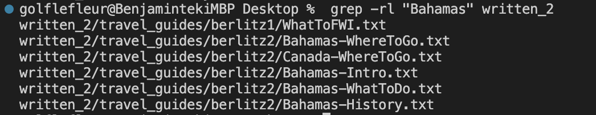
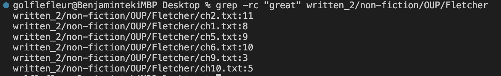

# Utilizing the Grep Command in different ways

The ```grep``` command can have many interesting utilities, and here I will demonstrate four different command line options that utilizes it:

1. Using ```grep -w``` or ```grep -wi``` to find exact lines:

   - As we know, using ```grep``` will return us matching words that contains the value in " " when we are using grep, but what if we are trying to find the exact word using grep? This is when we will use ```grep -w``` or ```grep -wi```
   
   - For example, if we are using ```grep "child" HistoryIndia.txt```, linux will give us the following output: 
   - As we can see, the command returns all words in the file including child, but if we uses ```grep -w "child" HistoryIndia.txt```, it will only return any lines containing the exact string child, which will give the following output: 
   - Here, lines including the string children is now not including in the output, and that is because we are using ```grep -w```
   - Now We can see that ```grep -w``` will give us the exact lines containing the input we are looking for, but using ```grep -wi``` will make it not case sensative
   - If we uses ```grep -wi "There" HistoryIndia.txt``` in linux, it will return all lines containing either a There or there: 
   - If we want to know the exact line numbers of our search, then we add ```n``` at the end, so ```grep -win "There" HistoryIndia.txt``` will give us a output that displays the line numbers of our exact capital or no capital search words: 

I found this ```grep``` use on youtube, and here is the [url](https://www.youtube.com/watch?v=VGgTmxXp7xQ&ab_channel=CoreySchafer)

2. Using ```grep -rl``` to find a file path that contains a certain word recursively in a directory

   - Now lets say we want to find all the file paths in written_2 that contains the word "Bahamas", we would have to use ```grep -rl``` to recursively search all the files in written_2 for the matching word, linux will print the file paths of all the files that contains the word Bahamas into the output. So as we type ```grep -rl "war" written_2```, the output displays: 
   
   -Now lest say we only want to use the same code to find the matching word "Bahamas" in a specific directory, we only have to give the absolute path. For example, lets narrow our search to the non-fiction directory, we would type ```grep -rl "Bahamas" written_2/non-fiction```, and the output is: 
   - Turns out no file in this directory contains the word "Bahamas"

I used the manual in linux for ```grep``` to study and understand this commmand-line

3. Using ```grep -c``` to count the matches of a pattern in a file

   - If we want to use a ```grep``` command line that allows us to count the number of times that a pattern appears, ```grep -c``` will do the trick. For example, if we want to find the number of times the word "to" is used in this aboslute file path ```written_2/non-fiction/OUP/Fletcher/ch2.txt```, we would use ```grep -c "to" written_2/non-fiction/OUP/Fletcher/ch2.txt``` and get: 
   
   
   - There appears to be 80 "to"'s in this file.
   - Now lets mix things up a little, because what if we want to recursively find the count of a word in each file in a given directory? We will be using ```grep -rc```
   - For example: ```grep -rc "great" written_2/non-fiction/OUP/Fletcher``` displays the count of all files containing the word "great" in this directory path, which gives us the output: 

I learned of this method using chatGPT, as I asked it to generate some useful grep commands, and I used my own knowledge of grep to inlcude the recursive search.

4. Using ```grep --color=always``` to highlight desired search parameters in a file

   - Now, lets say we are search for a commonly used word, and the grep would return a large text back to us, we could use the highlight method to make the output easier to read and our parameter easier to identify.
   - Lets say we want to highlight all the "power" in this file ```written_2/non-fiction/OUP/Fletcher/ch2.txt``` we would write in linux ```grep --color=always "power" written_2/non-fiction/OUP/Fletcher/ch2.txt``` to get our hightlighted output: 
   
