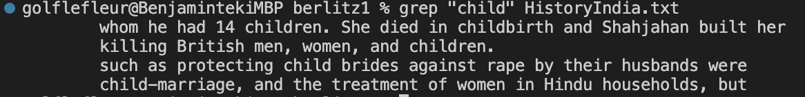
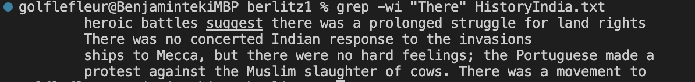
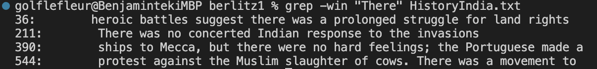

# Utilizing the Grep Command in different ways

The ```grep``` command can have many interesting utilities, and here I will demonstrate four different command line options that utilizes it:

1. Using ```grep -w``` or ```grep -wi``` to find exact lines:

   - As we know, using ```grep``` will return us matching words that contains the value in " " when we are using grep, but what if we are trying to find the exact word using grep? This is when we will use ```grep -w``` or ```grep -wi```
   
   - For example, if we are using ```grep "child" HistoryIndia.txt```, linux will give us the following output: 
   - As we can see, the command returns all words in the file including child, but if we uses ```grep -w "child" HistoryIndia.txt```, it will only return any lines containing the exact string child, which will give the following output: 
   - Here, lines including the string children is now not including in the output, and that is because we are using ```grep -w```
   - Now We can see that ```grep -w``` will give us the exact lines containing the input we are looking for, but using ```grep -wi``` will make it not case sensative
   - If we uses ```grep -wi "There" HistoryIndia.txt``` in linux, it will return all lines containing either a There or there: 
   - If we want to know the exact line numbers of our search, then we add ```n``` at the end, so ```grep -win "There" HistoryIndia.txt``` will give us a output that displays the line numbers of our exact capital or no capital search words: 

I found this ```grep``` use on youtube, and here is the [url](https://www.youtube.com/watch?v=VGgTmxXp7xQ&ab_channel=CoreySchafer)

2. 
   
   
