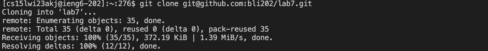
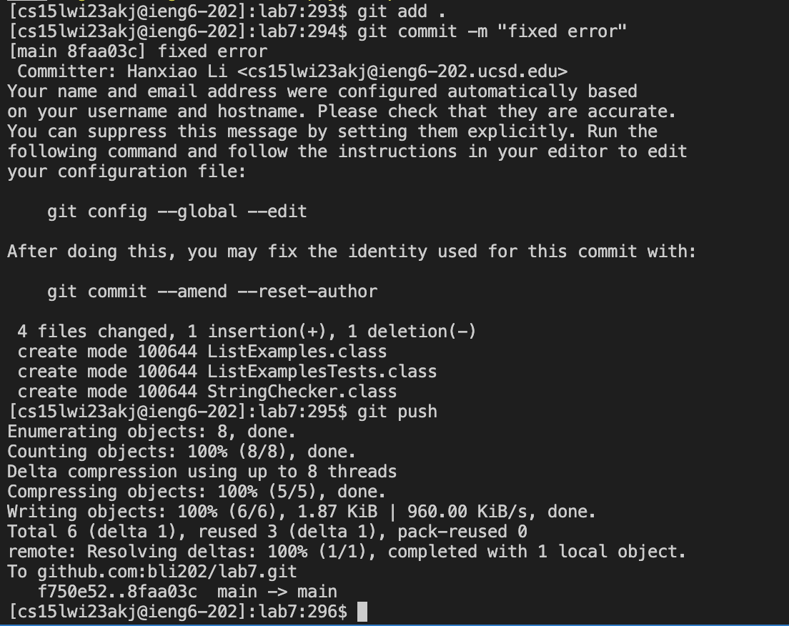
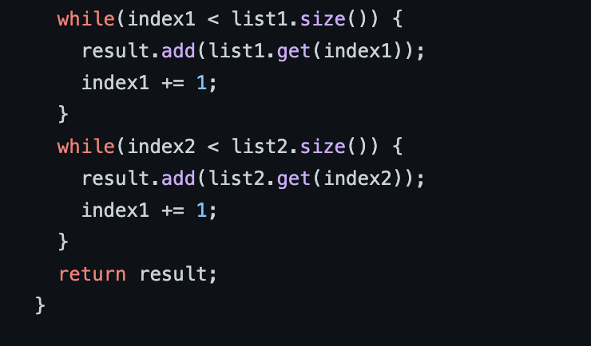

# Lab Report 4: A rundown of the lab challenges and how I did it #


## 1. Logging into ```ieng6``` ##
   - Since I just logged into ieng6 right before starting this lab, i only had to access one previous bash history to log into ieng6.
   
    
   Keys pressed: ```<up><enter>```
   
## 2. Cloning lab7 ##
  - In this step, I previously copied the ssh key of the forked repository so I could use ```git clone``` effectively
  
 
  Keys pressed: ```git clone <ctrl v><enter```
  
## 3. Running JUnit tests ##
  - In this step after I ```cd``` into the directory, I accessed directly into my bash history since I have not used the JUnit test lines in a while. This way I do not have to press the up keys many times to run my test.
  
  
  Keys pressed: ```<ctrl r> javac -cp <enter>```, ```<ctrl r> java -cp <enter>```
   
  - This automatically allowed me to access these command lines from my bash history.

## 4.Edit the code to pass the test ##
  - Since we know from our tester that something is wrong with ```testMerge``` I know specifically where to look for the error. So I used the ```nano``` command to examine my code.
  
  - I then found the error where the code is adding values to ```index1``` instead of ```index2``` creating an infinite loop. So I quickly corrected the mistake.
  
  
  Keys pressed for ```nano```: ```nano <ctrl v><enter>```: I quickly copied the desired file to look for so I don't have to type out its name.
  Keys pressed for fixing the error: ```<up><up><up><up><up><up><up><up><up><up><up><up><delete> <ctrl x><y><enter>``` I had to use ```ctrl x``` so I can save my edits
  
 ## 5.Run the JUnit tests again to show that they work ##
 
  - Now since we ran our JUnit tests recently I used the arrow keys to access them.
  
  
  Keys pressed: ```<up><up><up><enter>``` (complies the JUnit test), ```<up><up><enter>``` (runs the test).
  
## 6.Commit and Push our fixed code back to github ##
  
  - Now for this step since I know the commands and that they are relatively short, I prefer simply typing the commands out.
  
  
  Keys pressed: ```git add . <enter>```, ```git commit -m "fixed error" <enter>```, ```git push <enter>```. Here we also added a commit message, hence why we need the ```-m```.
  
  - Now if we can see our commit message in our forked lab7 repo in github:
  
  
  - And if we compare our forked lab7 code to the cse15 lab7 code, we will notice that there is a difference:
  - Fixed:
  
  
  
  - Original:
  
   
  
  
